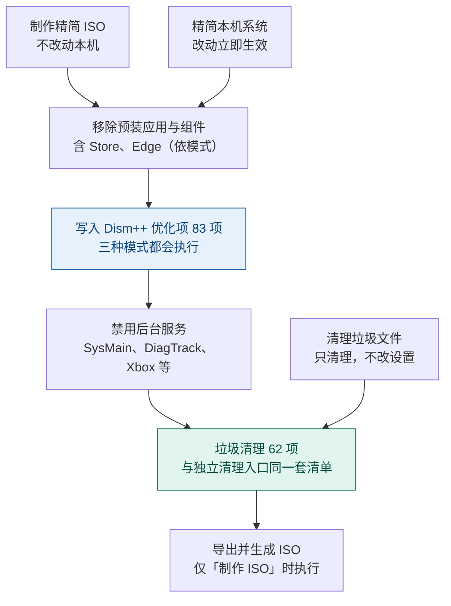

# tiny11builder（中文修改版）

用一个 PowerShell 脚本精简 Windows 11：既可以**精简当前正在使用的系统**，也可以**把官方 ISO 精简成可启动的精简 ISO**。提供三种精简模式，全程中文提示，并输出完整运行日志。

> 本脚本基于 [ntdevlabs/tiny11builder](https://github.com/ntdevlabs/tiny11builder) 修改合并而来。

---

## 第一步：选择操作对象

> 这是**命令行方式**的第一步。用**图形界面方式**时，这一步对应窗口里列出的操作清单；**两处的编号与顺序完全相同**（脚本内部由同一张任务清单生成，不会出现两边不一致的情况）。

| 编号    | 操作对象                     | 作用范围                | 可逆性               | 产物                                          |
| ----- | ------------------------ | ------------------- | ----------------- | ------------------------------------------- |
| `[1]` | **制作全新的精简 ISO**（推荐）      | 已挂载的 Windows 11 ISO | 可反复重来，不动本机        | `zh-cn_windows_11_<版型>_<版本>_<模式>_<时间戳>.iso` |
| `[2]` | **精简当前正在使用的系统**          | 本机（宿主机）             | **不可逆**，改动立即生效    | 精简后的本机系统                                    |
| `[3]` | 清理本机垃圾文件                 | 本机                  | **不可逆**（直接删除，不备份） | 无（直接生效）                                     |
| `[4]` | 禁用本机系统的 Windows Defender | 本机                  | 可逆（用 `[5]` 恢复）    | 无（直接生效）                                     |
| `[5]` | 恢复本机系统的 Windows Defender | 本机                  | 可逆                | 无（直接生效）                                     |
| `[6]` | 禁用本机系统的 Windows Update   | 本机                  | 可逆（用 `[7]` 恢复）    | 无（直接生效）                                     |
| `[7]` | 恢复本机系统的 Windows Update   | 本机                  | 可逆                | 无（直接生效）                                     |

- 选**精简当前正在使用的系统**：脚本**不会**创建还原点、也不备份注册表，确认一次后一路自动执行到结束。执行前请自行确认重要数据已有备份。
- 选**制作全新的精简 ISO**：脚本把 ISO 复制到临时目录、挂载映像、按规则精简后重新打包，最后用 `oscdimg.exe` 生成 `<语言>_windows_11_<版型>_<版本>_<精简模式>_<时间戳>.iso`（时间戳为生成时刻的 `yyyyMMdd_HHmmss`，与运行日志文件名同一格式；多次运行不会互相覆盖。语言取镜像默认系统界面语言代码小写（如 zh-cn，读不到回退 multi）；版型取自所选映像名映射：专业版=Professional、企业版=Enterprise、教育版=Education、家庭版=Home、专业教育版/专业工作站版=ProfessionalEducation/ProfessionalWorkstation，无法识别回退 Consumer。例如 `zh-cn_windows_11_Professional_26H2_TINY_20261001_144721.iso`）。ISO **卷标**为 `WIN11_<版本>_<精简模式>`（版本取自镜像注册表 DisplayVersion，如 26H2/25H2；精简模式映射：一般模式=TINY、激进模式=CORE、激进模式保留 Edge=CORE_EDGE），例如 `WIN11_26H2_CORE_EDGE`。

---

## 第二步：三种精简模式

> 图形界面方式下，这一步对应窗口「精简模式」里的三个选项，说明文字相同。

| 模式                | 可维护性           | Edge   | 主要动作                                                                                                                                                       |
| ----------------- | -------------- | ------ | ---------------------------------------------------------------------------------------------------------------------------------------------------------- |
| **一般模式**（推荐）      | ✅ 可打补丁、加语言、加功能 | 保留     | 移除预装应用与组件（含 Microsoft Store 与安全评估浏览器）；关闭广告、遥测；跳过硬件与微软账号检查                                                                                                  |
| **激进模式（移除 Edge）** | ❌ 不可维护         | **移除** | 在一般模式基础上：移除 Edge 全组件、精简重建 WinSxS、禁用 Defender、禁用 Windows Update、裁剪打印/扫描/传真/摄像头驱动（保留 Spooler）、精简极少使用的外语字体（其余字体一概保留）；制作 ISO 时可选 Windows Update 处理方式（物理精简/仅屏蔽） |
| **激进模式（保留 Edge）** | ❌ 不可维护         | 保留     | 与「移除 Edge」相同，但保留 Edge 及其组件与注册表                                                                                                                             |

- **一般模式**对应上游 `tiny11maker.ps1` 的思路：删得多，但系统仍可维护。
- **两种激进模式**对应上游 `tiny11coremaker.ps1` 的思路：把系统压到最小，但**装完无法再加语言、打补丁、加功能**。
- 「激进模式（移除 Edge）」会清除 `Edge`、`EdgeUpdate`、`EdgeCore`、`Microsoft-Edge-Webview` 等组件（在活动系统上改为调用 Edge 官方卸载程序），**请勿在需要使用浏览器的环境使用**。

> 三种模式在两种操作对象下通用，但**激进模式在「精简当前正在使用的系统」时会就地调整**（原因见下）：
>
> - **不重建 WinSxS** —— 对运行中的系统整体替换组件存储会直接使其无法启动；改用官方 `Dism /Online /Cleanup-Image /StartComponentCleanup /ResetBase` 压缩组件存储。
> - Windows Update / Defender 除了写注册表，还会直接**停止并禁用**相关服务。
> - WinRE 在所有模式下均保留（26H2 安装器硬性依赖镜像内的 `winre.wim`，删除会导致安装失败回滚，均已实测）。
>
> **两种激进模式（制作 ISO）会额外询问 Windows Update 的处理方式**：`物理精简`（默认——删除 `UsoSvc` / `WaaSMedicSVC` 服务键，装好后**无法**使用 Windows 自动在线搜索驱动，且无法完整恢复）或 `仅屏蔽`（不删任何服务键，只禁用 Windows Update / UsoSvc / WaaSMedicSvc / 传递优化（DoSvc）服务并屏蔽更新策略，可随时恢复，方法见下文《解除禁用》章节）。精简当前系统时固定为「仅屏蔽」行为（活动系统不删服务键）。

---

## 两种使用方式

### 方式一：图形界面（推荐 —— 不需要接触命令行）

适合不使用命令行的人。**双击 `启动.cmd` 即可**，其余都在窗口里完成：

1. 双击 **`启动.cmd`**。若系统弹出权限询问，点「是」——本工具需要管理员权限才能挂载映像、修改系统设置；
2. 在窗口里选择要执行的操作（按 **1 - 7** 编号：1 制作精简 ISO、2 精简本机、3 清理垃圾文件、4 - 7 本机 Defender / Windows Update 的禁用与恢复），**每个选项下方都有一行灰色说明**，选好后点「下一步」；
3. 若选「制作精简 ISO」：点「浏览…」选择已下载的 `.iso` 文件 —— **脚本会自动装载它，不需要手动装载**；随后选择映像版本与存放位置，需要时可勾选「启用 .NET Framework 3.5」；选「精简当前系统」则只需选择精简模式；
4. 点「开始」后请**不要关闭随后出现的窗口**（它会持续显示构建进度）。结束时会有弹窗提示，并告知成品位置。

> **重要：请先把整个 `tiny11builder` 文件夹复制到硬盘再运行**（例如复制到 `D:\tiny11builder`）。  
> 直接从光盘 / ISO 镜像里打开时文件夹是只读的，日志与成品 ISO 都存不下来；`启动.cmd` 检测到这种情况会提示你先复制。

`启动.cmd` 会自动处理三件原本需要手工完成的事：**请求管理员权限**、**放开本次运行的执行策略**（`-ExecutionPolicy Bypass -Scope Process`，不改动系统设置）、**进入脚本所在目录**。

### 方式二：命令行（进阶）

需要脚本化、批量执行或指定参数时使用 —— 见下方《使用说明（命令行方式 · 制作精简 ISO）》。

---

## 运行要求

| 项目      | 要求                                                                                                                                          |
| ------- | ------------------------------------------------------------------------------------------------------------------------------------------- |
| 系统      | Windows（脚本使用 Windows PowerShell 5.1 编写）                                                                                                     |
| 权限      | **管理员**。用 `启动.cmd` 双击运行时会自动请求；手工运行时需自己以管理员身份打开 PowerShell（脚本不会自动提权重启，会报错并给出方法）                                                              |
| 执行策略    | 用 `启动.cmd` 时自动放开（仅本次运行）。手工运行需先执行 `Set-ExecutionPolicy Bypass -Scope Process`                                                                |
| 输入镜像    | *仅「制作 ISO」*：Windows 11 ISO 文件（图形界面里浏览选择、自动装载）或已装载的 ISO 盘符；`sources` 下需有 `boot.wim` 与 `install.wim`；若只有 `install.esd`，脚本会自动转换为 `install.wim` |
| 临时盘     | *仅「制作 ISO」*：需预留 **20GB+** 空闲空间                                                                                                              |
| 网络      | *仅「制作 ISO」可能用到*：① `autounattend.xml` 已随本项目分发，仅在同目录缺失时会从本项目仓库下载；② 系统中没有 ADK 时会从微软下载 `oscdimg.exe`。**精简当前系统不需要联网**                            |
| 架构 / 语言 | 「制作 ISO」从镜像读取（`amd64` 与 `arm64` 有各自的 WinSxS 清单）；「精简当前系统」取本机 `PROCESSOR_ARCHITECTURE`                                                        |

---

## 使用说明（命令行方式 · 制作精简 ISO）

> 不使用命令行的话请用上面的**图形界面方式**，本节是等价的手工操作流程。

1. 从[微软官网](https://www.microsoft.com/software-download/windows11)下载 Windows 11 ISO。
2. 用资源管理器双击 ISO 完成**装载**，记下它的盘符（例如 `E`）。
3. 以**管理员身份**打开 PowerShell。
4. 放开当前会话的执行策略：
   ```powershell
   Set-ExecutionPolicy Bypass -Scope Process
   ```
   > `-Scope Process` 只对当前窗口生效，不会改动系统原有策略。
5. 运行脚本：
   ```powershell
   .\tiny11builder.ps1 -ISO E -SCRATCH D -Mode normal
   ```
   四个参数都可以省略（`-NetFx3` 仅对「制作 ISO」有意义），脚本会逐项交互询问：
   | 参数                                                                                                                    | 说明                                                       |
   | --------------------------------------------------------------------------------------------------------------------- | -------------------------------------------------------- |
   | `-ISO`                                                                                                                | 已装载 ISO 的盘符字母（**只写字母，不带冒号**，C–Z）                         |
   | `-SCRATCH`                                                                                                            | 临时盘字母（只写字母）。留空则交互询问；直接回车时临时盘＝脚本所在盘                       |
   | `-Mode`                                                                                                               | `normal` / `aggressive` / `aggressive_keepedge`          |
   | `-NetFx3`                                                                                                             | 指定此开关时直接启用 .NET Framework 3.5（跳过交互询问）。仅一般模式可用；镜像做好后无法再补装 |
   | `-Mode` 也接受中文与数字写法：`1` 或 `一般` → 一般模式；`2` 或 `激进` → 激进模式；`3`、`激进保留edge`、`keepedge` → 激进模式（保留 Edge）。**输入无法识别时会按一般模式处理。** |                                                          |
   > 临时目录统一建在 `<临时盘>\temp\` 下：`<临时盘>\temp\tiny11`（解包出的 ISO 树）与 `<临时盘>\temp\scratchdir`（映像挂载点）。
6. 按提示一次性完成所有输入：**若检测到上次运行的残留，先按 `Y` 确认清理** → **选择操作对象（输入 `1`）** → 选择精简模式 → 输入临时盘符 → 输入 ISO 盘符 → 输入映像索引（脚本会先列出 ISO 中包含的所有版本）→ 选择是否启用 .NET Framework 3.5（一般模式才会询问；激进模式固定不启用）→ 最后按 `Y` 确认。**确认之后脚本全程自动执行，中途不再需要任何按键**（含收尾清理），可以放着不管。
7. 等待完成。最慢的一步是**卸载并保存 `install.wim`**（把本次所有改动压缩写回），需要很长时间，而且**期间不会输出任何进度** —— 不是卡死，请耐心等待，勿中断或关闭窗口；脚本会在执行该步骤前打印提示。
8. 完成后，脚本目录下会生成 **`zh-cn_windows_11_<版型>_<版本>_<精简模式>_<时间戳>.iso`**，例如 `zh-cn_windows_11_Professional_26H2_TINY_20261001_144721.iso`（`yyyyMMdd_HHmmss`）
9. 运行日志在脚本目录下 **`LOG\tiny11_<时间戳>.log`**，例如 `tiny11_20260930_183317.log`（`yyyyMMdd_HHmmss`）；ISO 与日志用同一时间戳格式，便于配对排查。

---

## 使用说明（本机独立小工具 [3] - [7]）

选单中的 **[3] - [7]** 是独立小工具，只操作本机，不涉及 ISO 与临时目录，执行完即退出。**每个注册表改动都会逐条打印**（形如「已设置注册表项：…」「已删除注册表项：…」），服务改动则按服务逐条打印，便于事后核对改了什么：

- **[3] 清理本机垃圾文件**：按 62 项清理清单清理本机垃圾（临时文件、各类缓存、日志与报告、崩溃转储、回收站、各类安装源缓存、旧版本备份等），逐项输出「清理 N 项 / 失败 M 项」。只删文件，不改注册表、不移除应用。
- **[4] 禁用本机 Defender**：`WinDefend` / `WdNisSvc` / `WdNisDrv` / `WdFilter` / `Sense` 五个服务与驱动全部 `Start=4`，停止正在运行的服务，并隐藏设置中的「病毒和威胁防护」页。合并式隐藏——不会覆盖你此前隐藏的其它设置页。
- **[5] 恢复本机 Defender**：把上述五项恢复为 26H2 实测官方默认启动值（`WinDefend=2`、`WdNisSvc=3`、`Sense=3`、`WdNisDrv=3`、`WdFilter=0`），并删除设置页隐藏值（「Windows 更新」设置页也会一并恢复）。重启后生效。
- **[6] 禁用本机 Windows Update**：`wuauserv` / `UsoSvc` / `WaaSMedicSvc` / `DoSvc`（传递优化）四个服务全部 `Start=4` 并停止，写入更新策略（更新服务器指向 `localhost`、关闭自动更新与更新入口），隐藏「Windows 更新」设置页。
- **[7] 恢复本机 Windows Update**：四个服务恢复为手动启动并启动，删除更新策略、设置页隐藏值与全部 RunOnce 残留。

注意事项：

- 需要管理员权限（脚本入口已统一检查）。
- **[4] 禁用 Defender 可能被「篡改防护」改回**：需先在「Windows 安全中心 → 病毒和威胁防护 → 管理设置」里手动关闭篡改防护；建议执行后重启一次。
- **[7] 恢复的前提**：服务键必须存在。用「物理精简」方式构建的镜像（删除了 `UsoSvc` / `WaaSMedicSVC` 键）装出的系统上无法完整恢复；「仅屏蔽」方式或本机 `[6]` 禁用的可完整恢复。
- **[4] - [7]** 均**不删除任何服务键**，全部可逆；**[3] 垃圾清理不可逆**（直接删除、不备份）。

---

## 使用说明（精简当前正在使用的系统）

1. 以**管理员身份**打开 PowerShell，并放开执行策略（同上第 3、4 步）。
2. 运行脚本（**不要**传 `-ISO` / `-SCRATCH`，这两个参数只对「制作 ISO」有意义）：
   ```powershell
   .\tiny11builder.ps1 -Mode normal
   ```
3. 按提示输入：**若检测到上次运行的残留，先按 `Y` 确认清理** → **选择操作对象（输入 `2`）** → 选择精简模式 → 按 `Y` 确认。之后全程自动执行到结束，无需再按键。
4. 结束后重启一次，让服务禁用、组件存储清理等改动完全生效（脚本也会提示）。


> 与「制作 ISO」的差别：不挂载/导出任何映像、不使用 `autounattend.xml`、不做整体替换 WinSxS；注册表直接写入宿主机 `HKLM` 与**当前用户 `HKCU`**（映像里的"默认用户配置单元"在活动系统上不可写）；只跳过 `...\CurrentVersion\OOBE` 下**只对 OOBE 有意义**的项（如 `BypassNRO`）。

---

## 执行流程与功能分布

三条入口对应不同的动作组合 —— 只有「制作精简 ISO」与「精简本机系统」会走完整的主流程（**Dism++ 优化项就在这里应用**），独立小工具只做自己那一件事：



```

图中两个着色节点是这套工具仅有的两种改动：

- **Dism++ 优化项（83 项）跟着精简流程走** —— 制作 ISO 时写入**镜像**注册表，精简本机时写入**本机**注册表；一般 / 激进 / 激进保留 Edge 三种模式都执行。
- **垃圾清理（62 项）有两个入口** —— 精简流程末尾会执行一次，也可以用独立入口单独跑（图形界面与命令行选单的 `[3]`），后者**只清理文件、不改任何设置**。

此外，Defender 与 Windows Update 的禁用与恢复是四个**独立小工具**，只在选中时执行，不影响上面的流程。

---

```


## 脚本做了什么

1. 检查管理员权限 —— 非管理员时**直接报错退出**（不自动提权重启），并给出提权后重新运行的命令；开始记录日志。随后取得单实例锁（`LOG\tiny11.running`，防止两个实例同时运行互相破坏），并检查上次运行的残留（仍加载的注册表配置单元、仍挂载的映像、遗留的临时目录）—— 发现时列出清单、征得你同意后**强制终结**：卸载残留配置单元 → **丢弃式卸载**挂载映像（中止会话的改动一律不保存）→ 必要时结束滞留的 DISM worker 进程（wimserv / DismHost / TiWorker）→ 全部终结确认后才删除临时目录；无法确认是本工具留下的项目**只报告、不删除**。
2. 询问**操作对象**（精简当前系统 / 制作 ISO），再询问精简模式。
3. **制作 ISO** 分支：确保 `autounattend.xml` 存在（缺失则联网下载，下载失败即中止），一次性收集临时盘、ISO 盘符与映像索引，最后二次确认。  
   **精简当前系统**分支：只做一次二次确认（并提示操作不可逆）。
4. **制作 ISO** 分支：定位映像架构（回读映像）并挂载 `install.wim`。  
   **精简当前系统**分支：架构直接取自本机 `PROCESSOR_ARCHITECTURE`，并把 DISM 目标设为 `/Online`。
   > 从这一步起两条分支**共用同一份精简代码**，区别只在 DISM 参数是 `/Online` 还是 `/image:<挂载点>`。
5. **移除预装应用**：按 52 个包名前缀匹配，逐个用 DISM 移除（每一条都有中文提示），结束时汇总「成功 N / 失败 M」。  
   **精简当前系统**额外再用 `Get-AppxPackage` → `Remove-AppxPackage` 把**当前用户已安装**的同类应用一并卸掉（DISM 的预置包移除只保证新建用户不再预装）。
6. **移除 Microsoft Store、Store 购买应用、安全评估浏览器（所有模式）**：用 DISM 移除预置包，随后在注册表段写入「已取消预置」标记与 Store 关闭策略（防止功能更新回装）。
7. **激进模式（移除 Edge）**：制作 ISO 时删除 Edge、EdgeUpdate、EdgeCore、`System32\Microsoft-Edge-Webview`，以及 WinSxS 中的 edge-webview 组件目录（按架构匹配），并清理 Edge 卸载注册表项；精简当前系统时改为调用 Edge 官方卸载程序（找不到卸载程序就报告并跳过，**不硬删目录**）。
8. **移除 OneDrive**：制作 ISO 时删除镜像内的 `OneDriveSetup.exe`；精简当前系统时先运行 `OneDriveSetup.exe /uninstall` 再删除该文件。
9. 执行 `DISM /Cleanup-Image /StartComponentCleanup /ResetBase` 压缩组件存储 —— 制作 ISO 时**必须排在整体替换 WinSxS 之前**，否则 DISM 会因「指定的映像需要重新加载」而失败，并连带使挂载会话失效。精简当前系统时这一步就是组件存储压缩的全部内容（**不重建 WinSxS**）。
10. **启用 .NET Framework 3.5（可选，仅一般模式 + 制作 ISO）**：在组件存储压缩**之后**执行（功能启用会给镜像留下「挂起操作」，会挡住压缩；离线预装 .NET 3.5 是微软文档记载的标准部署做法，挂起事务由装好后的系统首次引导自动完成），源用 ISO 自带的 `sources\sxs`。激进模式**不提供**此选项：WinSxS 白名单重建会清掉 .NET 3.5 的组件负载，功能启用的挂起操作也会与压缩/重建流程冲突。
11. **注册表调整**：制作 ISO 时加载镜像的 COMPONENTS / DEFAULT / NTUSER / SOFTWARE / SYSTEM 五个配置单元；精简当前系统时直接写宿主机 `HKLM`，其中原属「默认用户配置单元」的项落到**当前用户 `HKCU`**。两组都完成：
    - 跳过硬件检查（CPU、内存、TPM、安全启动、存储）与升级限制；关闭「不支持的硬件」提示；
    - 关闭广告与推荐内容，禁用遥测（广告 ID、输入个性化、在线语音、诊断数据）；
    - 制作 ISO 时用应答文件创建本地账户（用户名 `user`、空密码、加入管理员组）并跳过微软账户登录，首次交互登录时要求修改密码；首次登录时还会自动卸载「入门」应用（Get Started —— 部分镜像不把它列入预置包，DISM 的预置包移除覆盖不到，只能在装好后按用户卸载）；另写入 `BypassNRO` 作为补充（该键在打过补丁的 24H2/25H2 上已失效）；
    - 禁用保留存储；禁用 BitLocker 设备加密；隐藏聊天图标；关闭 OneDrive 文件夹备份；
    - 阻止 DevHome 与新版 Outlook 自行安装；禁用 Copilot 及 Edge 侧栏；阻止 Teams 与新版 Outlook 安装；
    - **禁用 SysMain 服务**（预读 + 内存压缩）：应用冷启动可能略慢（SSD 上几乎无感），「已压缩内存」归零、同等负载下物理内存占用升高。服务键保留，完全可逆，恢复方法见《解除禁用》章节。
    - **禁用 DiagTrack 服务**（连接用户体验和遥测）：社区优化清单第一位——遥测策略之外，把这个持续后台采集诊断数据的服务本身也停掉。无任何服务依赖它，服务键保留、完全可逆（官方默认启动类型为手动）。
    - **禁用 Xbox Live 服务四件套**（XblAuthManager / XblGameSave / XboxNetApiSvc / XboxGipSvc）：Xbox 应用层已在预装清单移除，这四个后台服务本就没有可用的前端，禁用只省后台资源。副作用：依赖 Xbox Live 登录的第三方场景（如 PC Game Pass）不可用。服务键保留、完全可逆。
    - **应用 Dism++ 优化项（三模式共用，共 83 项）**：规则来自 [Chuyu-Team/Dism-Multi-language](https://github.com/Chuyu-Team/Dism-Multi-language) 的 `Data.xml`（MIT），按选定的编号逐项实现，取值一律取规则中「勾选」分支：
      - *服务禁用*：`PcaSvc`（程序兼容性助手）、`RemoteRegistry`（远程修改注册表）、`DPS`（诊断策略服务）、`WSearch`（Windows 搜索索引）、`WerSvc`（错误报告）、`TrkWks`（NTFS 链接跟踪）→ 写 `Start=4`，精简本机时额外停止服务。**副作用：禁用 `WSearch` 后开始菜单与资源管理器的搜索会明显变慢。**
      - *安全与启动*：UAC 调整为「提示我但不降低亮度」（`ConsentPromptBehaviorAdmin=5` + `PromptOnSecureDesktop=0`）、关闭 SmartScreen 应用筛选器、关闭快速启动（`HiberbootEnabled=0`）。**这三项降低默认防护或改变启动行为，是按你的选定执行的。**
      - *界面与体验*：任务栏（隐藏搜索框、从不合并、锁定、隐藏人脉）、主题与透明、开始菜单与体验（建议/推广/聚焦/技巧/游戏录制/小娜）、资源管理器（显示此电脑、显示扩展名、关闭视频与音乐预览、快速访问、语言栏、Win11 新右键菜单改经典）、右键菜单禁用、记事本、IE、微软拼音云计算、崩溃转储设为「无」、CBS/DPX 日志与组件文件备份关闭、关闭默认共享与远程协助、禁用 SMB1、隐藏导航窗格中的 OneDrive 等。
      - *用户级设置的落点*：制作 ISO 时**同时写**「默认用户模板」`Users\Default\ntuser.dat` 与「系统默认配置单元」`config\default`；精简本机时写**当前用户 `HKCU`**，并临时加载默认用户模板一并写入（新用户同样继承）。
      - *右键菜单/预览的禁用方式*：按规则把原键改名（`ShellEx` → `-ShellEx`；部分项备份到 `HKLM\SOFTWARE\Classes\DismRegBackup` 子树），**可逆**——把键名改回即可。
      - *未实现 3 项*（脚本内已注明）：`O040` / `O041` 需要 Dism++ 自带的 `Config\default.ui.zip` 资源；`O015` 规则值是交互取色。
12. **删除 5 处计划任务**：应用程序兼容性评估器、客户体验改进计划、程序数据更新器、Chkdsk 代理、Windows 错误报告。制作 ISO 时删除 `System32\Tasks` 下的定义文件；精简当前系统时改用 `Unregister-ScheduledTask` 逐条注销（这些文件受系统 ACL 保护）。
13. **激进模式**：禁用 Windows Update 与 Windows Defender。其中 Windows Update 在**制作 ISO 时由用户选择处理方式**：`物理精简`（删除 `WaaSMedicSVC` 与 `UsoSvc` 服务键，默认）或 `仅屏蔽`（服务键保留，禁用 `UsoSvc` / `WaaSMedicSvc` / `DoSvc` 服务，可恢复）。两者都会写入 RunOnce 项、把更新服务器指向 `localhost` 并屏蔽更新策略。精简当前系统时还会立即**停止并禁用** `wuauserv`、`UsoSvc`、`WaaSMedicSvc`、`WinDefend`、`WdNisSvc`、`Sense` 服务（固定为「仅屏蔽」行为，不删服务键）。
14. **外设驱动与字体裁剪（激进模式，仅制作 ISO）**：
    - **外设驱动**：按 **INF 精确全名名单**（15 项，来自 26H2 镜像实际枚举，不使用通配符）删除 DriverStore 中对应的驱动组件目录（微软类打印驱动 `prnge001` / `prnms002-015` 共 13 项、USB 打印 `usbprint`、USB 摄像头 `usbvideo`），并同步清理 `Windows\INF` 下的同名驱动定义与 `System32\spool\drivers` 打印驱动缓存；删除扫描（`stisvc`）、传真（`Fax`）、摄像头（`frameserver` / `FrameServerMonitor`）服务注册表项。**打印机相关服务（Spooler / PrintWorkflow / PrintNotify）保留** ——「打印成 PDF」不受影响，将来仍可安装厂商打印驱动；手机 USB 传文件（WPD/MTP）不受影响。
    - **字体**：采用**删除名单制 + 精确全名匹配**（21 个字体文件，来自 26H2 镜像实际枚举，不使用通配符）——仅精简极少使用的外语字体（传统蒙古文、藏文、新傣仂文、傣哪文、八思巴文、彝文、爪哇文、缅甸文、埃塞俄比亚文、西非文种、印度语系、Leelawadee UI、Segoe UI Historic），**其余字体一概保留**（含装饰性西文、简中/繁中/日/韩、系统 UI 与图标字体、legacy 字体与符号字体）。只删除 `.ttf` / `.ttc` / `.otf` / `.fon` 字体文件（`StaticCache.dat` 等缓存文件不动），字体文件与 `Fonts` 注册表值成对清理，避免留下指向空文件的残值。副作用：显示上述外语文字时个别字符可能显示为方块。
15. **激进模式（仅制作 ISO）**：精简重建 WinSxS 组件存储（只保留服务栈、VC 运行库、通用控件、`Manifests` / `Catalogs` / `FileMaps` 等必需组件）；精简当前系统时**跳过 WinSxS 重建**（对运行中的系统整体替换会直接使其无法启动，组件存储已由 `ResetBase` 压缩）。WinRE 在所有模式下均保留（见「三种精简模式」一节的说明）。
16. **制作 ISO** 分支后续：卸载注册表与映像 → 以最高压缩重新导出 `install.wim` → 对 `boot.wim` 的索引 2 重复「加载注册表 → 跳过硬件检查 → 卸载」，并把应答文件注入 `boot.wim` 根目录（即 WinPE 中的 `X:\Autounattend.xml`）→ 把 `autounattend.xml` 放入映像的 `System32\Sysprep` 与 ISO 根目录 → 把整个项目（脚本 `tiny11builder.ps1`、入口 `启动.cmd`、说明文档、应答文件）复制到 ISO 的 `tiny11builder\` 子目录，并在根目录生成单行 `readme.txt` 指引（引导先复制到硬盘、再运行 `启动.cmd`）→ 用 `oscdimg.exe` 生成 `<语言>_windows_11_<版型>_<版本>_<精简模式>_<时间戳>.iso`（卷标 `WIN11_<版本>_<精简模式>`，版本读自镜像注册表 DisplayVersion，语言与版型读自所选映像）→ 清理临时目录与下载的 `oscdimg.exe`。
17. **垃圾清理（三种模式 × 两种操作对象，共 62 项）**：按选定的编号逐项清理，逐项输出「清理 N 项 / 失败 M 项」，单项失败不中止；其中**目标是靠注册表定位的项**（各类旧版本备份、Installer 目录补丁判定）会额外打印注册表定位结果（如「注册表定位：`HKLM\...` → `路径`」），无记录时也会明确写出跳过原因，便于核对到底清了哪些目录。基准目录：制作 ISO 时为挂载映像目录，精简本机时为系统盘。内容涵盖临时文件与缓存（Windows 更新缓存、传递优化、缩略图、.NET 程序集、预读取、WinINet 与 Cookies、Appx 缓存）、日志与报告（事件日志、Windows 报告、各类 `*.log`）、崩溃转储与回收站、各类安装源缓存（Package Cache、Office、Visual Studio、SQL Server、Adobe、瑞昱/Intel/英伟达驱动）、旧版本备份、`Windows.old`、`MSOCache`、`$PatchCache$`、Installer 目录、驱动解压残留等。
    - **只在本机生效的项会自动跳过**：事件日志、回收站、WinINet 缓存/ Cookies 属于运行中的系统，制作 ISO 时镜像里没有对应内容（也不应触碰宿主机），脚本会跳过并报 0。
    - **不可逆**：清理不做备份；风险集中项（`Installer 目录` / `$PatchCache$` / `Office 安装源` / `Package Cache` / 各类安装源缓存）清理后，相关程序的卸载、修复、更改组件需要联网或准备安装镜像。  
      **精简当前系统**分支到此结束（提示重启）。

---

## 移除了什么

### 预装应用

两种操作对象、三种模式都会移除，按包名前缀匹配。**注意：「52」是匹配清单的长度，不等于实际移除的应用数量** —— 脚本只会移除镜像（或本机）里真实存在的包，不同版本 / 语言的镜像能匹配到几个各不相同。每次运行的日志里都会有「预装应用移除完成：成功 N / 失败 M」汇总，可按它确认本次实际移除了多少。

<details>

<summary>展开完整清单（52 个匹配前缀）</summary>

- Clipchamp 视频编辑器
- 必应资讯 / 必应搜索 / 必应天气
- Copilot（旧包名）/ Windows Copilot
- 跨设备互联
- Xbox 游戏应用 / Xbox 应用（旧版）/ Xbox 界面组件 / Xbox 游戏叠加 / Xbox Game Bar / Xbox 身份提供程序 / Xbox 语音转文字
- 获取帮助 / 入门（Get Started）/ 开始菜单推荐内容
- 3D 查看器 / Office 中心 / 微软纸牌合集 / 便笺 / 混合现实门户 / 画图 / OneNote / Office 推送通知组件
- 新版 Outlook
- 联系人 / 联系人体验主机 / 家长控制
- Power Automate
- Skype
- 微软待办 / 钱包
- Dev Home
- 内容交付管理器
- Teams（系统组件）/ Teams（旧包名，对应 2 个包名）
- 时钟 / 相机 / 邮件和日历
- 反馈中心 / 地图
- 手机连接
- 媒体播放器 / 电影和电视
- 微软家庭 / 快速助手
- Cortana
- Microsoft Store / Store 购买应用 / 安全评估浏览器

</details>

### 其他组件与调整

| 项目                                 | 一般模式 |  激进（移除 Edge）  |  激进（保留 Edge）  |
| ---------------------------------- | :--: | :-----------: | :-----------: |
| 预装应用（按 52 个前缀匹配，实际数量随镜像而变）         |   ✅  |       ✅       |       ✅       |
| OneDrive（`OneDriveSetup.exe`）      |   ✅  |       ✅       |       ✅       |
| 广告 / 遥测 / 硬件检查绕过等注册表调整             |   ✅  |       ✅       |       ✅       |
| 5 处计划任务                            |   ✅  |       ✅       |       ✅       |
| Microsoft Store、Store 购买应用、安全评估浏览器 |   ✅  |       ✅       |       ✅       |
| WinSxS 精简重建                        |   —  |       ✅       |       ✅       |
| Windows Defender（禁用）               |   —  |       ✅       |       ✅       |
| Windows Update（禁用）                 |   —  |       ✅       |       ✅       |
| Microsoft Edge 及其组件与卸载注册表项         |   —  |       ✅       |       —       |
| 外设驱动（打印/扫描/传真/摄像头，仅制作 ISO）         |   —  | ✅（保留 Spooler） | ✅（保留 Spooler） |
| 字体（极少使用的外语字体，仅制作 ISO）              |   —  |       ✅       |       ✅       |

> 激进模式下 Defender 是被**禁用**（相关服务启动类型设为 4），并非被删除。

### 两种操作对象的具体差别

| 项目                        | 制作全新的精简 ISO                                                                                       | 精简当前正在使用的系统                              |
| ------------------------- | ------------------------------------------------------------------------------------------------- | ---------------------------------------- |
| DISM 目标                   | `/image:<临时盘>\temp\scratchdir`                                                                    | `/Online`                                |
| 预装应用                      | 移除映像内的预置包                                                                                         | 移除本机预置包 + 卸载**当前用户已安装**的同类应用             |
| 注册表默认用户配置单元               | 映像的 `DEFAULT` / `NTUSER` 配置单元                                                                     | 当前用户 `HKCU`                              |
| OOBE 专属项（`BypassNRO` 等）   | 写入                                                                                                | **跳过**                                   |
| 应答文件                      | 放入 `System32\Sysprep`、`boot.wim` 根、ISO 根                                                          | 不使用                                      |
| `ResetBase`               | 整体替换 WinSxS **之前**执行                                                                              | 执行（同时替代 WinSxS 重建）                       |
| WinSxS 重建                 | 整体替换为保留清单                                                                                         | **不重建**（会损坏运行中的系统）                       |
| 计划任务                      | 删除 `System32\Tasks` 下的定义文件                                                                        | `Unregister-ScheduledTask` 逐条注销          |
| Edge 移除                   | 删除 Edge / EdgeUpdate / EdgeCore / `System32\Microsoft-Edge-Webview` 及 WinSxS 中的 edge-webview 组件目录 | 调用 Edge 官方卸载程序                           |
| 外设驱动与字体裁剪（激进模式）           | 删除四类外设驱动（保留 Spooler 与 PDF 打印）+ 极少使用的外语字体                                                          | 不执行                                      |
| .NET Framework 3.5        | 可选启用（源：ISO 内 `sources\sxs`）                                                                       | 不处理                                      |
| OneDrive                  | 删除 `OneDriveSetup.exe`                                                                            | 运行 `OneDriveSetup.exe /uninstall` 后删除该文件 |
| Windows Update / Defender | 只写注册表（OOBE 后生效）                                                                                   | 写注册表 + **立即停止并禁用**相关服务                   |

---

## 解除 Windows Defender / Windows Update 的禁用（激进模式）

> 一般模式不涉及（未禁用这两者）。以下按操作对象区分；涉及系统注册表的操作请以管理员身份执行。

### 一、精简当前正在使用的系统 —— 完全可恢复

服务只被停用/禁用、注册表只写了策略，没有删除任何服务键。管理员 PowerShell 执行：

```powershell
# 1. 恢复服务启动类型并启动
'wuauserv','UsoSvc','WaaSMedicSvc' | ForEach-Object {
    Set-Service $_ -StartupType Manual -ErrorAction SilentlyContinue }
Set-Service WinDefend -StartupType Automatic -ErrorAction SilentlyContinue
Set-Service WdNisSvc  -StartupType Automatic -ErrorAction SilentlyContinue
Set-Service Sense     -StartupType Manual    -ErrorAction SilentlyContinue
Start-Service WinDefend -ErrorAction SilentlyContinue
Start-Service wuauserv  -ErrorAction SilentlyContinue

# 2. 删除更新策略（含「更新服务器指向 localhost」的 WUServer 等全部条目）
Remove-Item 'HKLM:\SOFTWARE\Policies\Microsoft\Windows\WindowsUpdate' -Recurse -Force

# 3. 删除设置页隐藏（病毒防护/Windows 更新设置页）与首次登录停止更新的 RunOnce 残留
Remove-ItemProperty 'HKLM:\SOFTWARE\Microsoft\Windows\CurrentVersion\Policies\Explorer' `
    -Name SettingsPageVisibility -ErrorAction SilentlyContinue
'StopWUPostOOBE1','StopWUPostOOBE2','StopWUPostOOBE3','DisbaleWUPostOOBE1','DisbaleWUPostOOBE2' | ForEach-Object {
    Remove-ItemProperty 'HKLM:\SOFTWARE\Microsoft\Windows\CurrentVersion\RunOnce' `
        -Name $_ -ErrorAction SilentlyContinue
}
```

完成后重启，Defender 与 Windows Update 即恢复（「篡改防护」此前未开启，不会被拦截）。

### 二、制作 ISO 的激进模式 —— 物理精简（默认选择）

适用于在构建时选择了「物理精简」的情形（删除了 `WaaSMedicSVC` 与 `UsoSvc` 服务键）；选择了「仅屏蔽」的请看第三节。

**Windows Defender**：服务与驱动键仍在（仅被写入 `Start=4` 禁用值）。管理员命令行：

```cmd
reg add "HKLM\SYSTEM\CurrentControlSet\Services\WinDefend" /v Start /t REG_DWORD /d 2 /f
reg add "HKLM\SYSTEM\CurrentControlSet\Services\WdNisSvc" /v Start /t REG_DWORD /d 2 /f
reg add "HKLM\SYSTEM\CurrentControlSet\Services\Sense" /v Start /t REG_DWORD /d 3 /f
reg add "HKLM\SYSTEM\CurrentControlSet\Services\WdNisDrv" /v Start /t REG_DWORD /d 1 /f
reg add "HKLM\SYSTEM\CurrentControlSet\Services\WdFilter" /v Start /t REG_DWORD /d 0 /f
reg delete "HKLM\SOFTWARE\Policies\Microsoft\Windows\WindowsUpdate" /f
reg delete "HKLM\SOFTWARE\Microsoft\Windows\CurrentVersion\Policies\Explorer" /v SettingsPageVisibility /f
reg delete "HKLM\SOFTWARE\Microsoft\Windows\CurrentVersion\RunOnce" /v StopWUPostOOBE1 /f
reg delete "HKLM\SOFTWARE\Microsoft\Windows\CurrentVersion\RunOnce" /v StopWUPostOOBE2 /f
reg delete "HKLM\SOFTWARE\Microsoft\Windows\CurrentVersion\RunOnce" /v StopWUPostOOBE3 /f
reg delete "HKLM\SOFTWARE\Microsoft\Windows\CurrentVersion\RunOnce" /v DisbaleWUPostOOBE1 /f
reg delete "HKLM\SOFTWARE\Microsoft\Windows\CurrentVersion\RunOnce" /v DisbaleWUPostOOBE2 /f
```

> 两个驱动（`WdFilter` 引导启动、`WdNisDrv`）的 `Start` 默认值如有出入，请以任一正常安装的 Windows 11 的注册表对照为准。重启后 Defender 恢复运行。

**SysMain**（三种模式都会禁用，服务键保留）：恢复为官方默认自动启动：

```cmd
reg add "HKLM\SYSTEM\CurrentControlSet\Services\SysMain" /v Start /t REG_DWORD /d 2 /f
```

（或管理员 PowerShell：`Set-Service SysMain -StartupType Automatic` 后 `Start-Service SysMain`；恢复后内存压缩与预读随之恢复。）

**DiagTrack**（三种模式都会禁用，服务键保留）：恢复为官方默认手动启动：

```cmd
reg add "HKLM\SYSTEM\CurrentControlSet\Services\DiagTrack" /v Start /t REG_DWORD /d 3 /f
```

（或管理员 PowerShell：`Set-Service DiagTrack -StartupType Manual` 后 `Start-Service DiagTrack`。）

**Xbox Live 服务四件套**（三种模式都会禁用，服务键保留）：恢复为官方默认手动启动：

```cmd
for %s in (XblAuthManager XblGameSave XboxNetApiSvc XboxGipSvc) do reg add "HKLM\SYSTEM\CurrentControlSet\Services\%s" /v Start /t REG_DWORD /d 3 /f
```

（或管理员 PowerShell：`'XblAuthManager','XblGameSave','XboxNetApiSvc','XboxGipSvc' | ForEach-Object { Set-Service $_ -StartupType Manual; Start-Service $_ -ErrorAction SilentlyContinue }`。依赖 Xbox Live 登录的第三方场景随之恢复。）

**Windows Update**：`wuauserv` 的 `Start=4` 与更新策略可按同样方法恢复（`Start` 改 3、删除 `WindowsUpdate` 策略键与 RunOnce 残留）；但 **`WaaSMedicSVC` 与 `UsoSvc` 两个服务键已被整体删除**，无法用命令行简单还原，Windows Update 的完整编排能力不再可用。需要完整更新能力时的两条路：

1. 用一般模式重新制作并重装（推荐）；
2. 尝试用官方原版 ISO 就地升级（保留文件与应用，可把系统组件还原回官方状态；激进镜像上不保证升级流程百分之百成功）。

### 三、制作 ISO 的激进模式 —— 仅屏蔽（选择「仅屏蔽」时）

此模式**没有删除任何服务键**，Windows Update 与在线驱动搜索可**完整恢复**（Defender 的恢复方法同第二节）。

**恢复**（管理员 PowerShell）：

```powershell
# 1. 恢复服务启动类型并启动（服务键全部保留，直接改回即可）
'wuauserv','UsoSvc','WaaSMedicSvc','DoSvc' | ForEach-Object {
    Set-Service $_ -StartupType Manual -ErrorAction SilentlyContinue }
Start-Service wuauserv -ErrorAction SilentlyContinue

# 2. 删除更新策略、设置页隐藏与 RunOnce 残留（与第一节相同）
Remove-Item 'HKLM:\SOFTWARE\Policies\Microsoft\Windows\WindowsUpdate' -Recurse -Force
Remove-ItemProperty 'HKLM:\SOFTWARE\Microsoft\Windows\CurrentVersion\Policies\Explorer' `
    -Name SettingsPageVisibility -ErrorAction SilentlyContinue
'StopWUPostOOBE1','StopWUPostOOBE2','StopWUPostOOBE3','DisbaleWUPostOOBE1','DisbaleWUPostOOBE2' | ForEach-Object {
    Remove-ItemProperty 'HKLM:\SOFTWARE\Microsoft\Windows\CurrentVersion\RunOnce' `
        -Name $_ -ErrorAction SilentlyContinue
}
```

**再次屏蔽**（管理员 PowerShell，无需重跑脚本）：

```powershell
# 1. 停止并禁用 Windows Update 相关服务（含传递优化）
'wuauserv','UsoSvc','WaaSMedicSvc','DoSvc' | ForEach-Object {
    Stop-Service $_ -Force -ErrorAction SilentlyContinue
    Set-Service $_ -StartupType Disabled -ErrorAction SilentlyContinue }

# 2. 重新写入更新策略（更新服务器指向 localhost + 关闭自动更新与更新入口）
New-Item 'HKLM:\SOFTWARE\Policies\Microsoft\Windows\WindowsUpdate\AU' -Force | Out-Null
Set-ItemProperty 'HKLM:\SOFTWARE\Policies\Microsoft\Windows\WindowsUpdate' -Name DisableWindowsUpdateAccess -Value 1
Set-ItemProperty 'HKLM:\SOFTWARE\Policies\Microsoft\Windows\WindowsUpdate' -Name WUServer -Value 'localhost'
Set-ItemProperty 'HKLM:\SOFTWARE\Policies\Microsoft\Windows\WindowsUpdate' -Name WUStatusServer -Value 'localhost'
Set-ItemProperty 'HKLM:\SOFTWARE\Policies\Microsoft\Windows\WindowsUpdate\AU' -Name NoAutoUpdate -Value 1
```

> 恢复后 Windows 自动在线搜索驱动随之恢复；再次屏蔽后同样随之失效。

---

## 解除 Dism++ 优化项

> 这些项在**三种模式下都会应用**（不像 Defender / Windows Update 那样只在激进模式）。需要回到官方默认行为时按下表处理；改动系统注册表的操作请以管理员身份执行。

### 一、服务类（六个）

| 服务               | 作用           | 官方默认启动类型（参考） |
| ---------------- | ------------ | ------------ |
| `PcaSvc`         | 程序兼容性助手      | 手动（触发启动）     |
| `RemoteRegistry` | 远程修改注册表      | 禁用           |
| `DPS`            | 诊断策略服务       | 自动           |
| `WSearch`        | Windows 搜索索引 | 自动（延迟启动）     |
| `WerSvc`         | Windows 错误报告 | 手动（触发启动）     |
| `TrkWks`         | NTFS 链接跟踪    | 自动           |

> 「官方默认」取自 Windows 文档；**若你的机器出厂状态与此不同，以本机原始值为准**（最稳妥的对照方式是与一台未修改过的同版本系统比对）。恢复命令（命令提示符，管理员）：

```cmd
reg add "HKLM\SYSTEM\CurrentControlSet\Services\WSearch" /v Start /t REG_DWORD /d 2 /f
reg add "HKLM\SYSTEM\CurrentControlSet\Services\WerSvc"  /v Start /t REG_DWORD /d 3 /f
reg add "HKLM\SYSTEM\CurrentControlSet\Services\PcaSvc"  /v Start /t REG_DWORD /d 3 /f
reg add "HKLM\SYSTEM\CurrentControlSet\Services\DPS"     /v Start /t REG_DWORD /d 2 /f
reg add "HKLM\SYSTEM\CurrentControlSet\Services\TrkWks"  /v Start /t REG_DWORD /d 2 /f
reg add "HKLM\SYSTEM\CurrentControlSet\Services\RemoteRegistry" /v Start /t REG_DWORD /d 4 /f
```

也可以直接用「服务」管理器把启动类型改回去，两者等效。改完重启生效。

### 二、安全与启动类

| 项                 | 恢复值                                                                                    | 说明                         |
| ----------------- | -------------------------------------------------------------------------------------- | -------------------------- |
| UAC 提示级别          | `ConsentPromptBehaviorAdmin=5`、`PromptOnSecureDesktop=1`、`EnableLUA=1`                 | 恢复为「提示我」并重新启用安全桌面（提示时屏幕变暗） |
| SmartScreen 应用筛选器 | 删除 `HKLM\SOFTWARE\Microsoft\Windows\CurrentVersion\Explorer` 下的 `SmartScreenEnabled`   | 删除即回到系统默认                  |
| Edge 智能筛选         | `HKLM\SOFTWARE\Policies\Microsoft\MicrosoftEdge\PhishingFilter` 的 `EnabledV9 = 1`      | 恢复 SmartScreen 智能筛选        |
| 快速启动              | `HKLM\SYSTEM\CurrentControlSet\Control\Session Manager\Power` 的 `HiberbootEnabled = 1` | 恢复快速启动                     |

### 三、界面与右键菜单类

- **界面项**（任务栏、主题、Explorer、记事本、IE、拼音等）：删除对应注册表值即回到系统默认；也可以直接在「设置」里手动改回，两者等效。
- **右键菜单 / 文件预览**：脚本按 Dism++ 规则把原键**改名**（例如 `...\ShellEx` → `...\-ShellEx`；部分项搬到 `HKLM\SOFTWARE\Classes\DismRegBackup\...`）。要把菜单找回来，把键名改回原名即可（例如把 `-ShellEx` 改回 `ShellEx`）。
- **Windows 11 新右键菜单**（`O059`）：删除 `HKCU\Software\Classes\CLSID\{86ca1aa0-34aa-4e8b-a509-50c905bae2a2}` 即可恢复新样式。

---

## 已知问题与注意事项

- **精简当前正在使用的系统不可逆，且脚本不做任何兜底**：不会创建还原点、不备份注册表、不输出改动清单。改成什么样就是什么样，需要回退只能自己想办法。
- **活动系统上的 Defender 可能改不动**：Windows 的「篡改防护」会把 Defender 相关注册表改动改回。要生效需先在「Windows 安全中心 → 病毒和威胁防护 → 管理设置」里手动关闭篡改防护。
- **活动系统上不重建 WinSxS**：这不是遗漏，而是有意为之 —— 对运行中的系统整体替换组件存储会直接使其无法启动；改用官方 `ResetBase` 压缩。
- **激进模式不可维护**：装完无法再加语言、打补丁、加功能。建议只把它当作测试或开发用的最小系统。Defender 与 Windows Update 的部分恢复方法见下文《解除 Windows Defender / Windows Update 的禁用（激进模式）》。
- **Dism++ 优化项会改变系统默认行为，且三种模式都生效**：UAC 提示降级（提示时不再变暗屏幕）、SmartScreen 应用筛选关闭、快速启动关闭、Windows 搜索索引服务禁用（开始菜单与资源管理器搜索明显变慢）、程序兼容性助手 / 错误报告 / NTFS 链接跟踪 / 远程注册表服务禁用。这些是选定清单里的明确取舍；恢复方法见《解除 Dism++ 优化项》。
- **右键菜单与文件预览的禁用是「键重命名」**：原键被搬到带 `-` 前缀的位置（部分项备份到 `HKLM\SOFTWARE\Classes\DismRegBackup` 下），需要恢复时把键名改回原名即可。
- **垃圾清理不可逆**：直接删除、不做备份；`Installer 目录`、`$PatchCache$`、`Office 安装源`、`Package Cache`、各类安装源缓存被清理后，相应程序的卸载 / 修复 / 更改组件可能需要联网或安装镜像。制作 ISO 时只有少量可清理内容（镜像里没有日常运行产生的垃圾），多数清理项在镜像上报 0。
- **Dism++ 选定项中有 3 项未实现**：`O040`（隐藏可执行文件小盾牌）、`O041`（隐藏 NTFS 压缩标识）需要 Dism++ 自带的 `Config\default.ui.zip` 资源文件；`O015`（非活动窗口标题栏颜色）的规则值是交互取色（`?ColorDialog()`），脚本无法实现。三项均在脚本内注明跳过。
- **Microsoft Store 在所有模式下都会被移除**（含一般模式）：需要安装 Store 应用时请用其他渠道（如官网安装包、winget），或将镜像换回官方原版。
- **激进模式无法启用 .NET Framework 3.5**：功能启用会给镜像留下「挂起操作」（挡住组件存储压缩），而激进模式的 WinSxS 白名单重建也会清掉 .NET 3.5 的组件负载。需要 .NET 3.5 请用一般模式。
- **激进模式（制作 ISO）的外设驱动与字体裁剪不可逆**：打印、扫描、传真、摄像头四类驱动与极少使用的外语字体（蒙古文/藏文/缅甸文/印度语系等）装完无法加回。影响：扫描仪/传真/摄像头彻底不可用；打印机的 Spooler 服务与「打印成 PDF」保留，需要实机打印时装上厂商驱动即可；手机 USB 传文件不受影响；显示上述外语文字时个别字符可能显示为方块（其余字体含装饰性西文均保留）。
- **一般模式启用 .NET Framework 3.5 后镜像带「挂起操作」属正常**：挂起事务由装好后的系统首次引导自动完成（微软标准部署机制），不影响安装。
- **耗时较长，且最慢的一步静默**：完整流程需要预留充足的时间。其中最慢的是「卸载并保存 `install.wim`」（把所有改动压缩写回，整体替换 WinSxS 后要提交数万条文件删除）—— 这一步要等很久，且**期间没有任何输出**。脚本会在该步骤前打印提示，请不要因为长时间没有输出就中断；请保证供电，耐心等待。
- **收尾会自动删除**：`<临时盘>\temp\tiny11` 与 `<临时盘>\temp\scratchdir`；容器目录 `temp` 只在它已空时才一并删除（非空会保留并列出里面的内容）。另外脚本目录下的 `oscdimg.exe` 也会被删除，若你手动放置了它同样会被删。
- **中断后会留下残留，下次运行自动强制终结**：脚本没有 `try/finally` 兜底，但下次运行会在开头检测残留并征得你同意后彻底清理：卸载残留配置单元 → **丢弃式卸载**挂载映像（中止会话的改动一律不保存）→ 必要时结束滞留的 DISM worker 进程 → 确认全部卸载后才删除临时目录。手动处理的话注意：`Dism.exe /Cleanup-WIM` 只清孤儿记录、**卸不掉仍处于挂载状态的映像**，要用 `Dismount-WindowsImage -Path <挂载点> -Discard` 或 `Dism /Unmount-Image /MountDir:<挂载点> /Discard`；配置单元列表同上；最后删除 `<临时盘>\temp\tiny11` 与 `<临时盘>\temp\scratchdir`。
- **删除 `OneDriveSetup.exe` 时可能报一条可忽略的错误**：当镜像的 `System32` 下不存在该文件（有些镜像本身就没有，或已被上一次运行删掉）时会报「找不到路径」，不影响后续流程。**这与 CPU 架构无关**，amd64 镜像上同样会遇到。
- **结束后不再等待按键**：脚本结束后直接自动收尾退出，不会停在「按回车键退出」。若你是在新窗口里运行，窗口会随脚本结束自动关闭 —— 请以日志末尾与产物是否存在来判断结果。
- **脚本按「无人值守」设计，出错即中止**：中途若发现映像索引无效、挂载失败、导出失败等，脚本会明确报错并退出，**不会停下来等你输入**。重新运行即可。
- **需要联网**（仅「制作 ISO」）：`oscdimg.exe` 在系统未安装 ADK 时需要在线获取；`autounattend.xml` 已随本项目分发，仅在同目录缺失时才会联网下载。
- **模式输入无法识别时不报错**：`-Mode` 传入无法识别的值时，脚本会静默按一般模式处理。

## 避免控制台「假死」

传统控制台宿主（`conhost.exe`）默认开启**快速编辑模式**：脚本运行期间，只要鼠标在窗口里点一下或拖选，控制台就进入「选定」状态，**会阻塞进程的输出写入** —— 进程不崩溃、CPU 照常在动，但输出停住、脚本卡在写调用上，看起来完全像死机；按 **Enter / Esc / 右键**退出选定态即恢复。

### 方法一：改用 Windows Terminal（推荐）

Windows Terminal 选择文本**不会**阻塞进程输出，从根本上消除该问题。

- **直接用它运行脚本**（不改任何设置）：
  ```powershell
  wt.exe powershell.exe -NoExit -Command "cd <脚本所在目录>; .\tiny11builder.ps1"
  ```

### 方法二：关闭快速编辑模式

- **只改当前窗口**：窗口标题栏右键 → 属性 → 选项 → 取消勾选「快速编辑模式」→ 确定。（需要重开窗口）
- **改所有新窗口的默认值**：
  ```powershell
  reg add "HKCU\Console" /v QuickEdit /t REG_DWORD /d 0 /f
  ```
- 关掉后仍可手动选择复制：右键 → 编辑 → 标记。

## 致谢与声明

- 本项目基于 [ntdevlabs/tiny11builder](https://github.com/ntdevlabs/tiny11builder) 修改合并，感谢原作者 ntdev 的工作。
- 绕过 Windows 11 安装限制的思路来自 [pbatard/rufus](https://github.com/pbatard/rufus)（作者 Pete Batard 及贡献者），在此致谢。具体参考其 `src/wue.c`（Windows User Experience）：离线写入 `HKLM\SYSTEM\Setup\LabConfig` 绕过键、以及在应答文件中用 `<UserAccounts><LocalAccounts>` 创建本地账户以跳过微软账号登录。应答文件里「空密码用 Base64(UTF-16) 的 `UABhAHMAcwB3AG8AcgBkAA==` 表示」和「用 `net user <账户> /logonpasswordchg:yes` 实现首次登录改密」同样出自该项目。本项目**未复制其 C 源码**，只是参考并重新实现了这些机制；Rufus 以 GPLv3 发布，与本项目无代码级关联。
- **规则清单来自 [Chuyu-Team/Dism-Multi-language](https://github.com/Chuyu-Team/Dism-Multi-language)（Dism++），特此致谢**：本项目「系统优化」与「垃圾清理」两部分的条目，取自该项目的 `Data.xml` 规则文件（`SystemOptimization` 与 `CleanCollection4` 两段，以 MIT 许可证发布），感谢 Chuyu-Team 与 Dism++ 的贡献者长期维护这份规则清单。本项目**未包含 Dism++ 的任何二进制或源码**，而是把规则逐项翻译成 PowerShell 实现（`reg.exe` 写注册表 / 官方命令行 / 直接删文件），并按其中文描述整理成可核对的编号（优化项 `O001`–`O163`、清理项 `C01`–`C74`，脚本内注释与日志均沿用这套编号）。个别规则的值按原文照录，采纳前建议先在小范围验证；另有 3 项因依赖 Dism++ 自带的界面资源或交互取色而**未实现**（`O015`、`O040`、`O041`，脚本内已注明）。
- `autounattend.xml` 为本项目在上游同名应答文件基础上改写的版本（新增本地账户、OOBE 开关与首登改密）；`oscdimg.exe` 由微软 Windows ADK 提供。
- 上游 **tiny11builder** 仓库未声明开源许可证，本项目同样不授予任何许可证，请自行确认使用条款。
- 精简系统镜像存在风险，建议先在虚拟机或非关键环境中验证。
