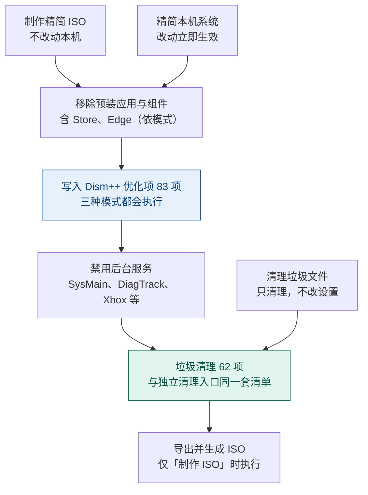

# tiny11builder（中文修改版）

用一个 PowerShell 脚本精简 Windows 11：既可以**精简当前正在使用的系统**，也可以**把官方 ISO 精简成可启动的精简 ISO**。全程中文提示，图形界面与命令行两种用法，并输出完整运行日志。

> 本脚本基于 [ntdevlabs/tiny11builder](https://github.com/ntdevlabs/tiny11builder) 修改合并而来。

---

## 能做什么（七个任务）

不带参数双击 `启动.cmd` 会打开图形界面，窗口里就是下面这 7 个任务。

| 编号    | 任务                       | 作用范围                | 可逆性               |
| ----- | ------------------------ | ------------------- | ----------------- |
| `[1]` | **制作全新的精简 ISO**（推荐）      | 已挂载的 Windows 11 ISO | 可反复重来，不动本机        |
| `[2]` | **精简当前正在使用的系统**          | 本机                  | **不可逆**，改动立即生效    |
| `[3]` | 清理本机垃圾文件                 | 本机                  | **不可逆**（直接删除，不备份） |
| `[4]` | 禁用本机系统的 Windows Defender | 本机                  | 可逆（用 `[5]` 恢复）    |
| `[5]` | 恢复本机系统的 Windows Defender | 本机                  | 可逆                |
| `[6]` | 禁用本机系统的 Windows Update   | 本机                  | 可逆（用 `[7]` 恢复）    |
| `[7]` | 恢复本机系统的 Windows Update   | 本机                  | 可逆                |

- **`[1]` `[2]` 走完整主流程**：移除预装应用与组件 → 应用系统优化项 → 禁用后台服务 → 垃圾清理。
- **`[3]` - `[7]` 是独立小工具**：只做自己那一件事，不涉及 ISO 与临时目录，执行完即退出。所有小工具都**逐条打印改了什么**（「已设置注册表项：…」「已删除注册表项：…」），方便事后核对。
  - `[3]` 按 62 项清单清理本机垃圾（临时文件、各类缓存、日志与报告、崩溃转储、回收站、安装源缓存、旧版本备份等），逐项输出「清理 N 项 / 失败 M 项」。**只删文件，不改注册表、不移除应用。**
  - `[4]` 把 `WinDefend` / `WdNisSvc` / `WdNisDrv` / `WdFilter` / `Sense` 五项全部设为 `Start=4` 并停止正在运行的服务，同时隐藏设置里的「病毒和威胁防护」页（合并式隐藏，不会覆盖你此前隐藏的其它设置页）。
  - `[5]` 把上述五项恢复为 26H2 实测官方默认启动值（`WinDefend=2`、`WdNisSvc=3`、`Sense=3`、`WdNisDrv=3`、`WdFilter=0`），并删除设置页隐藏值（「Windows 更新」页也会一并恢复）。重启后生效。
  - `[6]` 把 `wuauserv` / `UsoSvc` / `WaaSMedicSvc` / `DoSvc`（传递优化）四项设为 `Start=4` 并停止，更新服务器指向 `localhost`、关闭自动更新与更新入口，并隐藏「Windows 更新」页。
  - `[7]` 把上述四项恢复为手动启动，并删除更新策略、设置页隐藏值与全部 RunOnce 残留。
- 全部任务都需要**管理员权限**。

**制作 ISO 的成品**：文件名 `<语言>_windows_11_<版型>_<版本>_<模式>_<时间戳>.iso`，例如 `zh-cn_windows_11_Professional_26H2_TINY_20261001_144721.iso`；ISO 卷标 `WIN11_<版本>_<模式>`，例如 `WIN11_26H2_CORE_EDGE`。时间戳为生成时刻的 `yyyyMMdd_HHmmss`（与日志文件名同一格式），多次运行不会互相覆盖。

---

## 快速开始（图形界面，推荐）

**双击 `启动.cmd` 即可**，其余都在窗口里完成：

1. 双击 **`启动.cmd`**。系统弹出权限询问时点「是」—— 本工具需要管理员权限才能挂载映像、修改系统设置。
2. 在窗口里选择要执行的操作，选好后点「下一步」。
3. 若选「制作精简 ISO」：点「浏览…」选择 `.iso` 文件 —— **脚本会自动装载它，不需要手动装载**；随后选择映像版本与存放位置。**一般模式下这里显示「启用 .NET Framework 3.5」并默认勾选**（可取消）；**激进模式下不显示该项，改为显示「Windows Update 处理方式」（默认「仅屏蔽」）**。选「精简当前系统」则只需选择精简模式。
4. 点「开始」后请**不要关闭随后出现的窗口**（它会持续显示构建进度）。结束时会有弹窗提示，并告知成品位置。

> ⚠️ **请先把整个 `tiny11builder` 文件夹复制到硬盘再运行**（例如复制到 `D:\tiny11builder`）。  
> 直接从光盘 / ISO 镜像里打开时文件夹是只读的，日志与成品 ISO 都存不下来；`启动.cmd` 检测到这种情况会提示你先复制。

`启动.cmd` 会自动处理三件原本需要手工完成的事：**请求管理员权限**、**放开本次运行的执行策略**（`-ExecutionPolicy Bypass -Scope Process`，不改动系统设置）、**进入脚本所在目录**。

需要脚本化、批量执行或指定参数时，用下面的命令行方式。

---

## 运行要求

| 项目      | 要求                                                                                                                           |
| ------- | ---------------------------------------------------------------------------------------------------------------------------- |
| 系统      | Windows（脚本使用 Windows PowerShell 5.1 编写）                                                                                      |
| 权限      | **管理员**。用 `启动.cmd` 运行会自动请求；手工运行需自己以管理员身份打开 PowerShell                                                                        |
| 执行策略    | 用 `启动.cmd` 时自动放开（仅本次运行）。手工运行需先执行 `Set-ExecutionPolicy Bypass -Scope Process`                                                 |
| 输入镜像    | *仅「制作 ISO」*：Windows 11 ISO 文件（图形界面里浏览选择、自动装载）或已装载的 ISO 盘符；`sources` 下需有 `boot.wim` 与 `install.wim`，若只有 `install.esd` 脚本会自动转换 |
| 临时盘     | *仅「制作 ISO」*：需预留 **20GB+** 空闲空间                                                                                               |
| 网络      | *仅「制作 ISO」可能用到*：① `autounattend.xml` 已随本项目分发，仅在同目录缺失时下载；② 系统中没有 ADK 时会从微软下载 `oscdimg.exe`。**精简当前系统不需要联网**                    |
| 架构 / 语言 | 「制作 ISO」从镜像读取（`amd64` 与 `arm64` 有各自的 WinSxS 清单）；「精简当前系统」取本机 `PROCESSOR_ARCHITECTURE`                                         |

---

## 三种精简模式

图形界面方式下对应窗口「精简模式」里的三个选项。

| 模式                | 可维护性           | Edge   | 主要动作                                                                                                              |
| ----------------- | -------------- | ------ | ----------------------------------------------------------------------------------------------------------------- |
| **一般模式**（推荐）      | ✅ 可打补丁、加语言、加功能 | 保留     | 移除预装应用与组件（含 Microsoft Store 与安全评估浏览器）；关闭广告、遥测；跳过硬件与微软账号检查                                                         |
| **激进模式（移除 Edge）** | ❌ 不可维护         | **移除** | 在一般模式基础上：移除 Edge 全组件、精简重建 WinSxS、禁用 Defender、禁用 Windows Update、裁剪打印/扫描/传真/摄像头驱动（保留 Spooler）、精简极少使用的外语字体（其余字体一概保留） |
| **激进模式（保留 Edge）** | ❌ 不可维护         | 保留     | 与「移除 Edge」相同，但保留 Edge 及其组件与注册表                                                                                    |

- **一般模式**删得多，但系统仍可维护。
- **两种激进模式**把系统压到最小，但**装完无法再加语言、打补丁、加功能**。
- 「激进模式（移除 Edge）」会清除 Edge 及其组件与卸载注册表项，**请勿在需要使用浏览器的环境使用**。

激进模式在「精简当前正在使用的系统」时会就地调整两处：

- **不重建 WinSxS**，改用官方 `Dism /Online /Cleanup-Image /StartComponentCleanup /ResetBase` 压缩组件存储。
- Windows Update / Defender 除了写注册表，还会**立即停止并禁用**相关服务。

**制作 ISO 时，两种激进模式会额外询问 Windows Update 的处理方式（默认「仅屏蔽」）：**

- **`物理精简`** —— 删除 `UsoSvc` / `WaaSMedicSVC` 服务键。装好后**无法**使用 Windows 自动在线搜索驱动，且**无法完整恢复**。
- **`仅屏蔽`（默认）** —— 不删任何服务键，只禁用 Windows Update / UsoSvc / WaaSMedicSvc / 传递优化（DoSvc）服务并屏蔽更新策略。**可随时完整恢复**。

精简当前系统时固定为「仅屏蔽」（活动系统不删服务键）。两种情况下的恢复方法见《怎么恢复》。

---

## 命令行方式（进阶）

### 制作精简 ISO

1. 从[微软官网](https://www.microsoft.com/software-download/windows11)下载 Windows 11 ISO。
2. 用资源管理器双击 ISO 完成**装载**，记下它的盘符（例如 `E`）。
3. 以**管理员身份**打开 PowerShell，放开当前会话的执行策略：
   ```powershell
   Set-ExecutionPolicy Bypass -Scope Process
   ```
   > `-Scope Process` 只对当前窗口生效，不会改动系统原有策略。
4. 运行脚本：
   ```powershell
   .\tiny11builder.ps1 -ISO E -SCRATCH D -Mode normal
   ```
5. 按提示一次性完成所有输入：**若检测到上次运行的残留，先按 `Y` 确认清理** → 选择操作对象（输入 `1`）→ 选择精简模式 → 输入临时盘符 → 输入 ISO 盘符 → 选择映像索引（脚本会先列出 ISO 中包含的所有版本）→ 是否启用 .NET Framework 3.5（一般模式才会询问，**直接回车 = 启用**；激进模式固定不启用）→ 最后按 `Y` 确认。**确认之后脚本全程自动执行，中途不再需要任何按键**，可以放着不管。
6. 完成后，脚本目录下会生成 `<语言>_windows_11_<版型>_<版本>_<模式>_<时间戳>.iso`；运行日志在 `LOG\tiny11_<时间戳>.log`。

四个参数都可以省略，脚本会逐项交互询问：

| 参数         | 说明                                                    |
| ---------- | ----------------------------------------------------- |
| `-ISO`     | 已装载 ISO 的盘符字母（**只写字母，不带冒号**，C–Z）                      |
| `-SCRATCH` | 临时盘字母（只写字母）。留空则交互询问；直接回车时临时盘＝脚本所在盘                    |
| `-Mode`    | `normal` / `aggressive` / `aggressive_keepedge`       |
| `-NetFx3`  | 跳过交互询问、直接启用（不指定时会询问，**直接回车 = 启用**）。仅一般模式可用；镜像做好后无法再补装 |

`-Mode` 也接受中文与数字写法：`1` 或 `一般` → 一般模式；`2` 或 `激进` → 激进模式；`3`、`激进保留edge`、`keepedge` → 激进模式（保留 Edge）。**输入无法识别时会按一般模式处理。**

> 临时目录统一建在 `<临时盘>\temp\` 下：`tiny11`（解包出的 ISO 树）与 `scratchdir`（映像挂载点）；收尾时会自动清理。

**注意**：最慢的一步是**卸载并保存 `install.wim`**（把本次所有改动压缩写回），需要很长时间，而且**期间不会输出任何进度** —— 不是卡死，请耐心等待，勿中断或关闭窗口；脚本会在执行该步骤前打印提示。

### 精简当前正在使用的系统

1. 以**管理员身份**打开 PowerShell，并放开执行策略（同上第 3 步）。
2. 运行脚本（**不要**传 `-ISO` / `-SCRATCH`，这两个参数只对「制作 ISO」有意义）：
   ```powershell
   .\tiny11builder.ps1 -Mode normal
   ```
3. 按提示输入：**若检测到上次运行的残留，先按 `Y` 确认清理** → 选择操作对象（输入 `2`）→ 选择精简模式 → 按 `Y` 确认。之后全程自动执行到结束，无需再按键。
4. 结束后重启一次，让服务禁用、组件存储清理等改动完全生效（脚本也会提示）。

> 与「制作 ISO」的差别：不挂载/导出任何映像、不使用 `autounattend.xml`、**不做整体替换 WinSxS**（改用 `ResetBase` 压缩）、不提供 .NET Framework 3.5；注册表直接写宿主机 `HKLM` 与**当前用户 `HKCU`**（原属「默认用户配置单元」的项落到当前用户，新建用户不再继承）；Windows Update / Defender 除写注册表外还会**立即停止并禁用**相关服务；只跳过 `...\CurrentVersion\OOBE` 下**只对 OOBE 有意义**的项（如 `BypassNRO`）。

---

## 会移除 / 会禁用 / 会调整什么（最终结果）

### 执行流程与功能分布

三条入口对应不同的动作组合 —— 只有「制作精简 ISO」与「精简本机系统」会走完整的主流程（**系统优化项就在这里应用**），独立小工具只做自己那一件事：



图中两个着色节点是这套工具仅有的两种改动：

- **Dism++ 优化项（83 项）跟着精简流程走** —— 制作 ISO 时写入**镜像**注册表，精简本机时写入**本机**注册表；一般 / 激进 / 激进保留 Edge 三种模式都执行。
- **垃圾清理（62 项）有两个入口** —— 精简流程末尾会执行一次，也可以用 `[3]` 单独跑，后者**只清理文件、不改任何设置**。

Defender 与 Windows Update 的禁用与恢复是四个**独立小工具**，只在选中时执行，不影响上面的流程。

### 三种模式的差别

下表**只列三种模式有差别的项目**；其余项目（预装应用、OneDrive、广告与遥测绕过等注册表调整、5 处计划任务、Store 三件套、系统优化项 83 项、垃圾清理 62 项）三种模式都会执行。

| 项目                                   | 一般模式 |  激进（移除 Edge）  |  激进（保留 Edge）  |
| ------------------------------------ | :--: | :-----------: | :-----------: |
| WinSxS 精简重建（仅制作 ISO）                 |   —  |       ✅       |       ✅       |
| Windows Defender（禁用，非删除）             |   —  |       ✅       |       ✅       |
| Windows Update（禁用）                   |   —  |       ✅       |       ✅       |
| Microsoft Edge 及其组件与卸载注册表项           |   —  |       ✅       |       —       |
| 外设驱动（打印/扫描/传真/摄像头，仅制作 ISO）           |   —  | ✅（保留 Spooler） | ✅（保留 Spooler） |
| 字体（极少使用的外语字体，仅制作 ISO）                |   —  |       ✅       |       ✅       |
| .NET Framework 3.5（默认启用、可取消，仅制作 ISO） |   ✅  |       —       |       —       |

### 预装应用

两种操作对象、三种模式都会移除，按包名前缀匹配。**注意：「52」是匹配清单的长度，不等于实际移除的应用数量** —— 脚本只会移除镜像（或本机）里真实存在的包，不同版本 / 语言的镜像能匹配到几个各不相同。每次运行的日志里都会有「预装应用移除完成：成功 N / 失败 M」汇总，可按它确认本次实际移除了多少。

<details>

<summary>展开完整清单（52 个匹配前缀）</summary>

- Clipchamp 视频编辑器
- 必应资讯 / 必应搜索 / 必应天气
- Copilot（旧包名）/ Windows Copilot
- 跨设备互联
- Xbox 游戏应用 / Xbox 应用（旧版）/ Xbox 界面组件 / Xbox 游戏叠加 / Xbox Game Bar / Xbox 身份提供程序 / Xbox 语音转文字
- 获取帮助 / 入门（Get Started）/ 开始菜单推荐内容
- 3D 查看器 / Office 中心 / 微软纸牌合集 / 便笺 / 混合现实门户 / 画图 / OneNote / Office 推送通知组件
- 新版 Outlook
- 联系人 / 联系人体验主机 / 家长控制
- Power Automate
- Skype
- 微软待办 / 钱包
- Dev Home
- 内容交付管理器
- Teams（系统组件）/ Teams（旧包名，对应 2 个包名）
- 时钟 / 相机 / 邮件和日历
- 反馈中心 / 地图
- 手机连接
- 媒体播放器 / 电影和电视
- 微软家庭 / 快速助手
- Cortana
- Microsoft Store / Store 购买应用 / 安全评估浏览器

</details>

### 其他调整与禁用一览

- **移除 Microsoft Store、Store 购买应用、安全评估浏览器**（所有模式，含一般模式）：用 DISM 移除预置包，并写入「已取消预置」标记与 Store 关闭策略，防止功能更新回装。
- **移除 OneDrive**：制作 ISO 时删除镜像内的 `OneDriveSetup.exe`；精简当前系统时先运行 `OneDriveSetup.exe /uninstall` 再删除该文件。（若镜像的 `System32` 下本来就没有该文件，删除时会报一条可忽略的「找不到路径」，**与 CPU 架构无关**。）
- **删除 5 处计划任务**：应用程序兼容性评估器、客户体验改进计划、程序数据更新器、Chkdsk 代理、Windows 错误报告。
- **制作 ISO 的收尾处理**：把应答文件放进 `boot.wim`、镜像的 `System32\Sysprep` 与 ISO 根目录；把整个项目（脚本、`启动.cmd`、说明文档）复制到 ISO 的 `tiny11builder\` 子目录，并在根目录生成单行 `readme.txt` 指引（引导先复制到硬盘、再运行 `启动.cmd`）。
- **压缩组件存储**：执行官方 `Dism /Online /Cleanup-Image /StartComponentCleanup /ResetBase`。激进模式在制作 ISO 时进一步**精简重建 WinSxS**（只保留服务栈、VC 运行库、通用控件、`Manifests` / `Catalogs` / `FileMaps` 等必需组件）。
- **启用 .NET Framework 3.5**（可选，仅一般模式 + 制作 ISO）：源用 ISO 自带的 `sources\sxs`，镜像做好后无法再补装。（启用后镜像带「挂起操作」属正常，由装好后的系统首次引导自动完成，不影响安装。）
- **绕过安装限制**：跳过 CPU、内存、TPM、安全启动、存储检查与升级限制，并关闭「不支持的硬件」提示。
- **关闭广告与遥测**：广告与推荐内容、广告 ID、输入个性化、在线语音、诊断数据。
- **本地账户与 OOBE**（仅制作 ISO，靠应答文件）：创建本地账户 `user`（空密码、管理员组）、跳过微软账号登录、首次登录时要求修改密码；首次登录还会自动卸载「入门」应用（部分镜像不把它列入预置包，DISM 覆盖不到）。另写入 `BypassNRO` 作为补充（该键在打过补丁的 24H2/25H2 上已失效）。
- **其它注册表调整**：禁用保留存储、禁用 BitLocker 设备加密、隐藏聊天图标、关闭 OneDrive 文件夹备份、阻止 DevHome / 新版 Outlook / Teams 自行安装、禁用 Copilot 及 Edge 侧栏。
- **禁用后台服务（三种模式都执行，服务键保留、完全可逆）**：
  - `SysMain`（预读 + 内存压缩）—— 应用冷启动可能略慢（SSD 上几乎无感），「已压缩内存」归零、同等负载下物理内存占用升高。
  - `DiagTrack`（连接用户体验和遥测）—— 无任何服务依赖它，官方默认启动类型为手动。
  - Xbox Live 四件套（`XblAuthManager` / `XblGameSave` / `XboxNetApiSvc` / `XboxGipSvc`）—— 副作用：依赖 Xbox Live 登录的第三方场景（如 PC Game Pass）不可用。
  - 恢复命令见《怎么恢复》。
- **应用 Dism++ 优化项（83 项，三种模式都执行）**：规则清单来自 [Chuyu-Team/Dism-Multi-language](https://github.com/Chuyu-Team/Dism-Multi-language) 的 `Data.xml`（MIT），按选定编号逐项实现，取值一律取规则中「勾选」分支。主要分四类：
  - *服务禁用*：`PcaSvc`（程序兼容性助手）、`RemoteRegistry`（远程修改注册表）、`DPS`（诊断策略服务）、`WSearch`（Windows 搜索索引）、`WerSvc`（错误报告）、`TrkWks`（NTFS 链接跟踪）→ 写 `Start=4`，精简本机时额外停止服务。**副作用：禁用 `WSearch` 后开始菜单与资源管理器的搜索会明显变慢。**
  - *安全与启动*：UAC 调整为「提示我但不降低亮度」（`ConsentPromptBehaviorAdmin=5` + `PromptOnSecureDesktop=0`）、关闭 SmartScreen 应用筛选器、关闭快速启动。**这三项降低默认防护或改变启动行为。**
  - *界面与体验*：任务栏（隐藏搜索框、从不合并、锁定、隐藏人脉）、主题与透明、开始菜单与体验（建议/推广/聚焦/技巧/游戏录制/小娜）、资源管理器（显示此电脑、显示扩展名、关闭视频与音乐预览、快速访问、语言栏、Win11 新右键菜单改经典）、右键菜单禁用、记事本、IE、微软拼音云计算、崩溃转储设为「无」、关闭默认共享与远程协助、禁用 SMB1、隐藏导航窗格中的 OneDrive 等。
  - *右键菜单与文件预览*：按规则把原键**改名**（`ShellEx` → `-ShellEx`，部分项备份到 `HKLM\SOFTWARE\Classes\DismRegBackup` 子树），**可逆** —— 把键名改回即可。
- **垃圾清理（62 项，三种模式 × 两种操作对象共用）**：逐项输出「清理 N 项 / 失败 M 项」，单项失败不中止。内容涵盖临时文件与缓存（更新缓存、传递优化、缩略图、.NET 程序集、预读取、WinINet 与 Cookies、Appx 缓存）、日志与报告、崩溃转储与回收站、各类安装源缓存（Package Cache、Office、Visual Studio、SQL Server、Adobe、显卡驱动）、旧版本备份、`Windows.old`、`MSOCache`、`$PatchCache$`、Installer 目录、驱动解压残留等。基准目录：制作 ISO 时为挂载映像目录，精简本机时为系统盘。
  - **只在本机生效的项会自动跳过**：事件日志、回收站、WinINet 缓存 / Cookies 属于运行中的系统，制作 ISO 时会跳过并报 0。
  - **不可逆**：清理不做备份。
- **外设驱动与字体裁剪（激进模式，仅制作 ISO，装完无法加回）**：
  - *外设驱动*：按 **INF 精确全名名单**（15 项）删除 DriverStore 中对应的打印 / 扫描 / 传真 / 摄像头驱动组件，并清理 `Windows\INF` 下的同名定义与打印驱动缓存；删除扫描（`stisvc`）、传真（`Fax`）、摄像头（`frameserver` / `FrameServerMonitor`）服务。**打印机服务（Spooler / PrintWorkflow / PrintNotify）保留** ——「打印成 PDF」不受影响，将来仍可安装厂商打印驱动；手机 USB 传文件（WPD/MTP）不受影响。
  - *字体*：采用**删除名单制**（21 个字体文件），只精简极少使用的外语字体（传统蒙古文、藏文、傣仂文、八思巴文、彝文、爪哇文、缅甸文、埃塞俄比亚文、印度语系等），**其余字体一概保留**（含装饰性西文、简中/繁中/日/韩、系统 UI 与图标字体）。副作用：显示上述外语文字时个别字符可能显示为方块。


## 注意事项

- **精简当前正在使用的系统不可逆，且脚本不做任何兜底**：不会创建还原点、不备份注册表、不输出改动清单。
- **活动系统上的 Defender 可能改不动**：Windows 的「篡改防护」会把 Defender 相关注册表改动改回。要生效需先在「Windows 安全中心 → 病毒和威胁防护 → 管理设置」里手动关闭篡改防护。
- **激进模式不可维护**：装完无法再加语言、打补丁、加功能，建议只当作测试或开发用的最小系统。
- **Dism++ 优化项会改变系统默认行为，且三种模式都生效**：UAC 提示降级（提示时不再变暗屏幕）、SmartScreen 应用筛选关闭、快速启动关闭、搜索索引服务禁用（搜索明显变慢）、程序兼容性助手 / 错误报告 / NTFS 链接跟踪 / 远程注册表服务禁用。
- **Microsoft Store 在所有模式下都会被移除**（含一般模式）：需要安装 Store 应用时请用其他渠道（官网安装包、winget），或把镜像换回官方原版。
- **外设驱动与字体裁剪（激进模式 + 制作 ISO）不可逆**：扫描仪 / 传真 / 摄像头彻底不可用；打印机的 Spooler 与「打印成 PDF」保留，实机打印时装上厂商驱动即可；手机 USB 传文件不受影响；显示上述外语文字时个别字符可能显示为方块。
- **垃圾清理不可逆**：不做备份。`Installer 目录`、`$PatchCache$`、`Office 安装源`、`Package Cache`、各类安装源缓存被清理后，相应程序的卸载 / 修复 / 更改组件可能需要联网或安装镜像。制作 ISO 时只有少量可清理内容（镜像里没有日常运行产生的垃圾），多数清理项报 0。
- **耗时较长，且最慢的一步静默**：最慢的是「卸载并保存 `install.wim`」，请保证供电、耐心等待，不要因为长时间没有输出就中断。
- **脚本按「无人值守」设计，出错即中止**；结束后直接自动收尾退出，若是新窗口运行，窗口会随脚本结束自动关闭 —— 请以日志末尾与产物是否存在来判断结果。
- **中断后会留下残留，下次运行自动强制终结**：脚本没有兜底，但下次运行会在开头检测残留、列出清单并征得你同意后清理（卸载残留配置单元 → **丢弃式卸载**挂载映像，中止会话的改动一律不保存 → 必要时结束滞留的 DISM worker 进程 → 删临时目录）；无法确认是本工具留下的项目**只报告、不删除**。手动处理时注意：`Dism.exe /Cleanup-WIM` 只清孤儿记录、**卸不掉仍处于挂载状态的映像**，要用 `Dismount-WindowsImage -Path <挂载点> -Discard` 或 `Dism /Unmount-Image /MountDir:<挂载点> /Discard`。
- **收尾会自动删除**：`<临时盘>\temp\tiny11`、`<临时盘>\temp\scratchdir`（容器目录 `temp` 只在它已空时才一并删除），以及脚本目录下的 `oscdimg.exe`（若你手动放置了它同样会被删）。
- **`-Mode` 传入无法识别的值时不报错**，脚本会静默按一般模式处理。
- **控制台「假死」**：传统控制台宿主（`conhost.exe`）默认开启**快速编辑模式**，脚本运行期间鼠标在窗口里点一下或拖选就会阻塞进程的输出写入 —— 进程没崩、CPU 照常在动，但输出停住、看起来完全像死机；按 **Enter / Esc / 右键**退出选定态即恢复。彻底解决有两个办法：
  - **改用 Windows Terminal**（推荐）：选择文本不会阻塞输出。可直接用它运行脚本（不改任何设置）：
    ```powershell
    wt.exe powershell.exe -NoExit -Command "cd <脚本所在目录>; .\tiny11builder.ps1"
    ```
  - **关闭快速编辑模式**：窗口标题栏右键 → 属性 → 选项 → 取消勾选「快速编辑模式」→ 确定（需重开窗口）；改所有新窗口的默认值：
    ```powershell
    reg add "HKCU\Console" /v QuickEdit /t REG_DWORD /d 0 /f
    ```

---

## 致谢与声明

- 本项目基于 [ntdevlabs/tiny11builder](https://github.com/ntdevlabs/tiny11builder) 修改合并，感谢原作者 ntdev 的工作。
- 绕过 Windows 11 安装限制的思路来自 [pbatard/rufus](https://github.com/pbatard/rufus)（作者 Pete Batard 及贡献者），在此致谢。具体参考其 `src/wue.c`（Windows User Experience）：离线写入 `HKLM\SYSTEM\Setup\LabConfig` 绕过键、以及在应答文件中用 `<UserAccounts><LocalAccounts>` 创建本地账户以跳过微软账号登录。应答文件里「空密码用 Base64(UTF-16) 的 `UABhAHMAcwB3AG8AcgBkAA==` 表示」和「用 `net user <账户> /logonpasswordchg:yes` 实现首次登录改密」同样出自该项目。本项目**未复制其 C 源码**，只是参考并重新实现了这些机制；Rufus 以 GPLv3 发布，与本项目无代码级关联。
- **规则清单来自 [Chuyu-Team/Dism-Multi-language](https://github.com/Chuyu-Team/Dism-Multi-language)（Dism++），特此致谢**：本项目「系统优化」与「垃圾清理」两部分的条目，取自该项目的 `Data.xml` 规则文件（`SystemOptimization` 与 `CleanCollection4` 两段，以 MIT 许可证发布），感谢 Chuyu-Team 与 Dism++ 的贡献者长期维护这份规则清单。本项目**未包含 Dism++ 的任何二进制或源码**，而是把规则逐项翻译成 PowerShell 实现（`reg.exe` 写注册表 / 官方命令行 / 直接删文件），并按其中文描述整理成可核对的编号（优化项 `O001`–`O163`、清理项 `C01`–`C74`，脚本内注释与日志均沿用这套编号）。个别规则的值按原文照录，采纳前建议先在小范围验证；另有 3 项因依赖 Dism++ 自带的界面资源或交互取色而**未实现**（`O015`、`O040`、`O041`）。
- `autounattend.xml` 为本项目在上游同名应答文件基础上改写的版本（新增本地账户、OOBE 开关与首登改密）；`oscdimg.exe` 由微软 Windows ADK 提供。
- 上游 **tiny11builder** 仓库未声明开源许可证，本项目同样不授予任何许可证，请自行确认使用条款。
- 精简系统镜像存在风险，建议先在虚拟机或非关键环境中验证。
